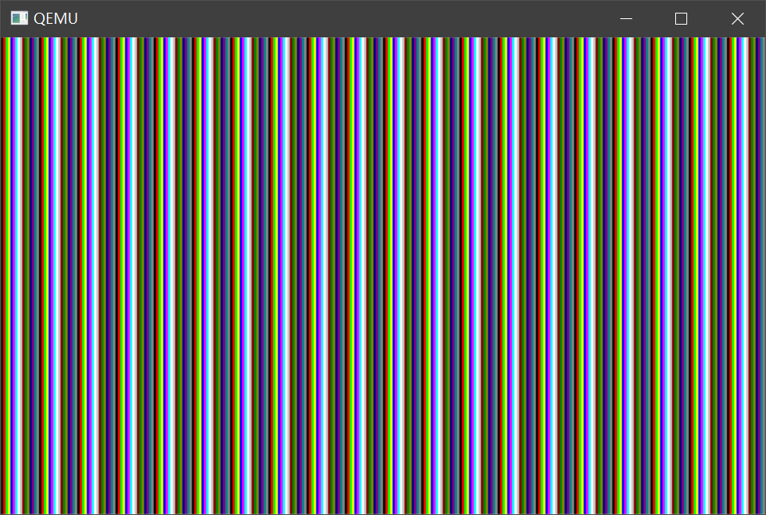
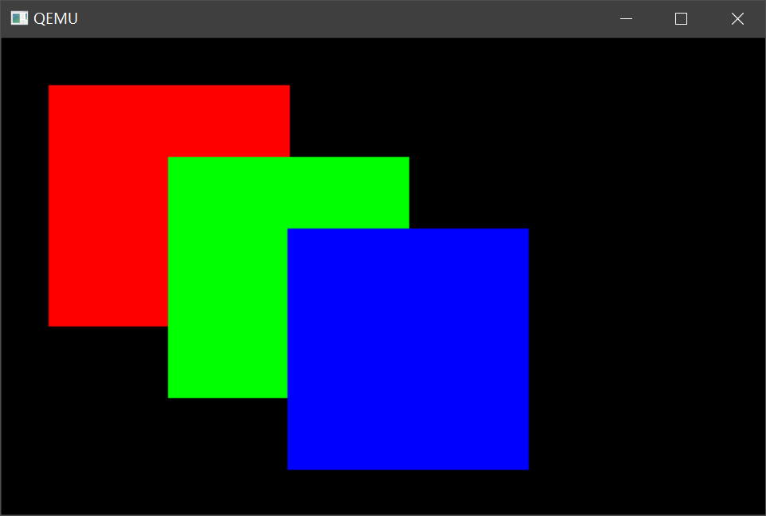

# 04 C语言和画面显示的练习

原文中作者花了很大的力气讲解C语言的有关知识，这里就不多赘述了。。

## 1. 显示模式和显存

前一天的内容作者就将我们的操作系统的显示设置为`VGA 320*200 8 位调色板`模式，8位意味着我们可以使用256种颜色，但本质上VGA还是RGB成色模式，需要3个字节表示一个完整的颜色，我们只能设置色号，就是一个8位数到24位颜色的映射，设置的方法后面介绍。

并且将显示的分辨率设置为`320*200`，每一个像素都需要一个字节（8位）来表示颜色

此模式下显存的地址范围为`0xa0000 -0xaffff`，但是一个像素存储一个字节只需要`320*200`字节，但是显存范围是64K比存储像素的大一些，也不知是什么原因。。

## 2. 汇编实现内存写入

```assembly
_write_mem8: ; void write_mem8(int addr, int data);
    MOV ECX,[ESP+4] ; [ESP + 4]中存放的是地址， 将其读入ECX
    MOV AL,[ESP+8] ; [ESP + 8]中存放的是数据， 将其读入AL
    MOV [ECX],AL
RET
```

这里是32位模式所以我们使用的寄存器都是拓展寄存器，这里C语言编译器函数参数是从右到左压入栈，所以这里只是简单的把一个32位的数据写到指定的32位地址的内存中去

## 3. 色号设定

前面提到过我们的显示模式是VGA 8位调色板模式，需要自己对不同的256个颜色编号指定不同的颜色。作者使用了16种颜色来绘制他的操作系统，如下：

```c
static unsigned char table_rgb[16 * 3] = {
	0x00, 0x00, 0x00,	/*  0:黑 */
	0xff, 0x00, 0x00,	/*  1:梁红 */
	0x00, 0xff, 0x00,	/*  2:亮绿 */
	0xff, 0xff, 0x00,	/*  3:亮黄 */
	0x00, 0x00, 0xff,	/*  4:亮蓝 */
	0xff, 0x00, 0xff,	/*  5:亮紫 */
	0x00, 0xff, 0xff,	/*  6:浅亮蓝 */
	0xff, 0xff, 0xff,	/*  7:白 */
	0xc6, 0xc6, 0xc6,	/*  8:亮灰 */
	0x84, 0x00, 0x00,	/*  9:暗红 */
	0x00, 0x84, 0x00,	/* 10:暗绿 */
	0x84, 0x84, 0x00,	/* 11:暗黄 */
	0x00, 0x00, 0x84,	/* 12:暗青 */
	0x84, 0x00, 0x84,	/* 13:暗紫 */
	0x00, 0x84, 0x84,	/* 14:浅暗蓝 */
	0x84, 0x84, 0x84	/* 15:暗灰 */
};
```

同时作者提供了许多帮助写如端口的函数：

```c
void io_hlt(void); // 之前出现过的悬停CPU
void io_cli(void); // 中断标识位清零
void io_out8(int port, int data);	// 输出8位数据
int io_load_eflags(void);	// 返回表示寄存器值
void io_store_eflags(int eflags); // 使用eflags重载表示寄存器
```

其汇编实现如下：

```assembly
; naskfunc
; TAB=4

[FORMAT "WCOFF"]				; 制作目标文件的模式	
[INSTRSET "i486p"]				; 使用到486为止的指令
[BITS 32]						; 3制作32位模式用的机器语言
[FILE "naskfunc.nas"]			; 文件名

		GLOBAL	_io_hlt, _io_cli, _io_sti, _io_stihlt
		GLOBAL	_io_in8,  _io_in16,  _io_in32
		GLOBAL	_io_out8, _io_out16, _io_out32
		GLOBAL	_io_load_eflags, _io_store_eflags

[SECTION .text]

_io_hlt:	; void io_hlt(void);
		HLT
		RET

_io_cli:	; void io_cli(void);
		CLI
		RET

_io_sti:	; void io_sti(void);
		STI
		RET

_io_stihlt:	; void io_stihlt(void);
		STI
		HLT
		RET

_io_in8:	; int io_in8(int port);
		MOV		EDX,[ESP+4]		; port
		MOV		EAX,0
		IN		AL,DX
		RET

_io_in16:	; int io_in16(int port);
		MOV		EDX,[ESP+4]		; port
		MOV		EAX,0
		IN		AX,DX
		RET

_io_in32:	; int io_in32(int port);
		MOV		EDX,[ESP+4]		; port
		IN		EAX,DX
		RET

_io_out8:	; void io_out8(int port, int data);
		MOV		EDX,[ESP+4]		; port
		MOV		AL,[ESP+8]		; data
		OUT		DX,AL
		RET

_io_out16:	; void io_out16(int port, int data);
		MOV		EDX,[ESP+4]		; port
		MOV		EAX,[ESP+8]		; data
		OUT		DX,AX
		RET

_io_out32:	; void io_out32(int port, int data);
		MOV		EDX,[ESP+4]		; port
		MOV		EAX,[ESP+8]		; data
		OUT		DX,EAX
		RET

_io_load_eflags:	; int io_load_eflags(void);
		PUSHFD		; PUSH EFLAGS 
		POP		EAX
		RET

_io_store_eflags:	; void io_store_eflags(int eflags);
		MOV		EAX,[ESP+4]
		PUSH	EAX
		POPFD		; POP EFLAGS 
		RET
```

代码中右`IN OUT`指令，这两个指令是CPU和其他输入输出设备交互的必备指令，`IN`从指定端口读入数据，`OUT`则是写数据，注意汇编中（C语言编译后）函数的返回值都是通过EAX寄存器

接下来要开始真正设置色号，VGA 调色板模式设置流程如下：

1. 首先在一连串的访问中屏蔽中断（比如CLI） 。
2. 将想要设定的调色板号码写入0x03c8， 紧接着， 按R， G， B的顺序写入
0x03c9。 如果还想继续设定下一个调色板， 则省略调色板号码， 再按照RGB的
顺序写入0x03c9就行了。
3. 如果想要读出当前调色板的状态， 首先要将调色板的号码写入0x03c7， 再从
0x03c9读取3次。 读出的顺序就是R， G， B。 如果要继续读出下一个调色板， 同
样也是省略调色板号码的设定， 按RGB的顺序读出。
4. 如果最初执行了CLI， 那么最后要执行STI

对应的C语言代码如下：

```c
void io_hlt(void);
void io_cli(void);
void io_out8(int port, int data);
int io_load_eflags(void);
void io_store_eflags(int eflags);
/*就算写在同一个源文件里， 如果想在定义前使用， 还是必须事先声明一下。 */
void init_palette(void);
void set_palette(int start, int end, unsigned char *rgb);
void HariMain(void)
{
	int i; /* 声明变量。 变量i是32位整数型 */
	char *p; /* 变量p是BYTE [...]用的地址 */
	init_palette(); /* 设定调色板 */
    p = (char *) 0xa0000; /* 指定地址 */
    for (i = 0; i <= 0xffff; i++) {
    	p[i] = i & 0x0f;
	} 
    for (;;) {
		io_hlt();
	}
} 

void init_palette(void)
{
    static unsigned char table_rgb[16 * 3] = {
        0x00, 0x00, 0x00, /* 0:黑 */
        0xff, 0x00, 0x00, /* 1:亮红 */
    	0x00, 0xff, 0x00, /* 2:亮绿 */
        0xff, 0xff, 0x00, /* 3:亮黄 */
        0x00, 0x00, 0xff, /* 4:亮蓝 */
        0xff, 0x00, 0xff, /* 5:亮紫 */
        0x00, 0xff, 0xff, /* 6:浅亮蓝 */
        0xff, 0xff, 0xff, /* 7:白 */
        0xc6, 0xc6, 0xc6, /* 8:亮灰 */
        0x84, 0x00, 0x00, /* 9:暗红 */
        0x00, 0x84, 0x00, /* 10:暗绿 */
        0x84, 0x84, 0x00, /* 11:暗黄 */
        0x00, 0x00, 0x84, /* 12:暗青 */
        0x84, 0x00, 0x84, /* 13:暗紫 */
        0x00, 0x84, 0x84, /* 14:浅暗蓝 */
        0x84, 0x84, 0x84 /* 15:暗灰 */
	};
	set_palette(0, 15, table_rgb);
	return;
/* C语言中的static char语句只能用于数据， 相当于汇编中的DB指令 */
} 
void set_palette(int start, int end, unsigned char *rgb)
{
    int i, eflags;
    eflags = io_load_eflags(); /* 记录中断许可标志的值*/
    io_cli(); /* 将中断许可标志置为0， 禁止中断 */
    io_out8(0x03c8, start);
    for (i = start; i <= end; i++) {
    	io_out8(0x03c9, rgb[0] / 4);
    	io_out8(0x03c9, rgb[1] / 4);
    	io_out8(0x03c9, rgb[2] / 4);
		rgb += 3;
	}
    io_store_eflags(eflags); /* 复原中断许可标志 */
	return;
}
```

效果图如下：



## 3. 绘制矩形

画面坐标系都是左上坐标系（左上角为顶点），所以对于坐标`(x,y)`我们只需要通过`0xa0000 + x + y * 320`定为该坐标的对应地址，这么一来绘制矩形就简单多了

绘制矩形代码如下：

```c
/*
vram: 对应显存地址 0xa0000
xsize: 对应宽
c: 颜色编号
左上-右下坐标
*/
void boxfill8(unsigned char *vram, int xsize, unsigned char c, int x0, int y0, int x1, int y1)
{
	int x, y;
	for (y = y0; y <= y1; y++) {
		for (x = x0; x <= x1; x++)
			vram[y * xsize + x] = c;
	}
	return;
}
```

效果图如下：



作者最后还绘制了一个简陋的界面都是通过绘制矩形实现这里就不多说了