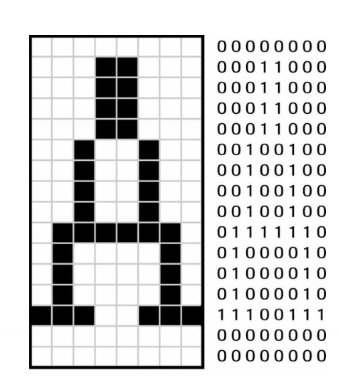
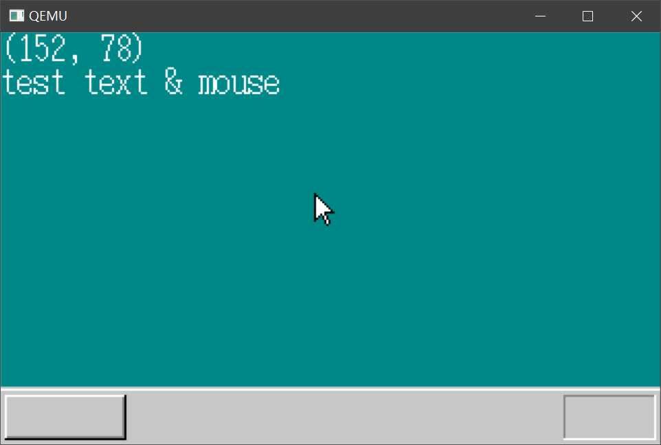
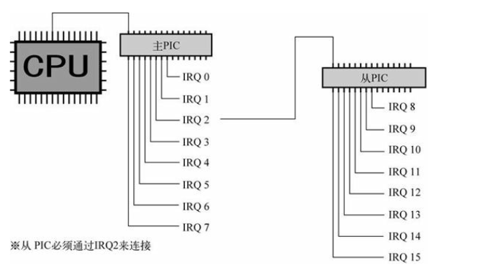
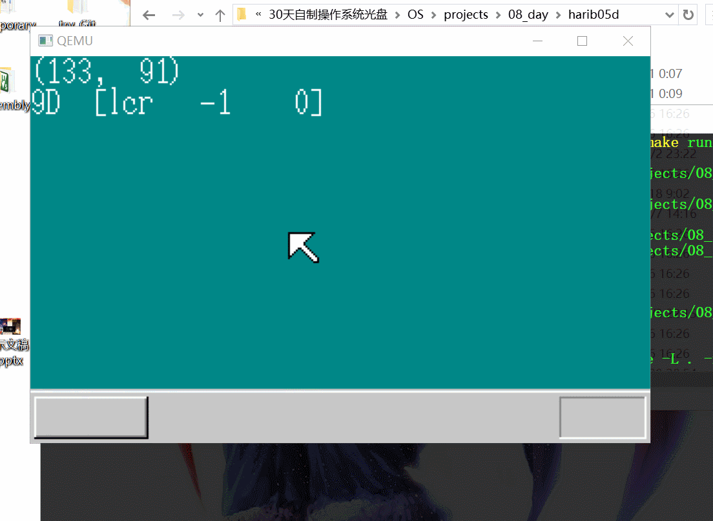

# 05-08 从字符显示到中断处理

## 1. 文字鼠标显示

### a. 定义BOOTINFO结构体

> 这个结构体包含操作系统的基础信息

结构体声明如下：

```c
struct BOOTINFO {
	char cyls, leds, vmode, reserve;
	short scrnx, scrny;
	char *vram;
};
```

对应的信息如下：

```assembly
; asmhead.nas
; BOOT_INFO相关
CYLS	EQU		0x0ff0			; 引导扇区设置
LEDS	EQU		0x0ff1
VMODE	EQU		0x0ff2			; 关于颜色的信息
SCRNX	EQU		0x0ff4			; 分辨率X
SCRNY	EQU		0x0ff6			; 分辨率Y
VRAM	EQU		0x0ff8			; 图像缓冲区的起始地址
		ORG		0xc200			;  这个的程序要被装载的内存地址

; 画面设定

		MOV		AL,0x13			; VGA显卡，320x200x8bit
		MOV		AH,0x00
		INT		0x10
		MOV		BYTE [VMODE],8	; 屏幕的模式（参考C语言的引用）
		MOV		WORD [SCRNX],320
		MOV		WORD [SCRNY],200
		MOV		DWORD [VRAM],0x000a0000		
```

作者没有对`BOOTINFO.reserve`说明，仔细看`asmhead.nas`可以发现VMODE只有一个字节的内容，但是`SCRNX`是从`0xff4`开始，中间有一个字节是没有做任何设定的，由此可以看出这一个字节的内容是暂时保留的。

启动信息的开始地址是0xff0，所以我们通过```struct BOOTINFO *binfo = (struct BOOTINFO *) 0x0ff0;```设置好我们的结构体。

### b. 字符和鼠标指针显示

简单来说，和之前我们绘制矩形一样的思路，整个屏幕都是就是一个`320*200`大小的一个画布，需要显示字符只要将对应位置置为一个颜色就可以了，如下



其中每一个1代表此处应该置为一个对应颜色，此时的字体大小为16*8

作者给出的函数是：

```c
// 只是将位为1的位置置为对应的颜色
void putfont8(char *vram, int xsize, int x, int y, char c, char *font)
{
	int i;
	char *p, d /* data */;
	for (i = 0; i < 16; i++) {
		p = vram + (y + i) * xsize + x;
		d = font[i];
		if ((d & 0x80) != 0) { p[0] = c; }
		if ((d & 0x40) != 0) { p[1] = c; }
		if ((d & 0x20) != 0) { p[2] = c; }
		if ((d & 0x10) != 0) { p[3] = c; }
		if ((d & 0x08) != 0) { p[4] = c; }
		if ((d & 0x04) != 0) { p[5] = c; }
		if ((d & 0x02) != 0) { p[6] = c; }
		if ((d & 0x01) != 0) { p[7] = c; }
	}
	return;
}
```

作者给出了他为每一个字符定义的字体，如下：

```c
// hankaku.txt
// 此文件通过作者的 makefont.exe编译为目标文件
// 只是将其中的字体文件解析相应的字节数据
char 0x41
........
...**...
...**...
...**...
...**...
..*..*..
..*..*..
..*..*..
..*..*..
.******.
.*....*.
.*....*.
.*....*.
***..***
........
........
```

因为这是外部定义的数据，所以在我们的C语言源文件中，需要使用的话需要增加 ***extern char hankaku[4096];***

字符串的显示也类似处理即可

```c
void putfonts8_asc(char *vram, int xsize, int x, int y, char c, unsigned char *s)
{
	extern char hankaku[4096];
	for (; *s != 0x00; s++) {
		putfont8(vram, xsize, x, y, c, hankaku + *s * 16);
		x += 8;
	}
	return;
}
```

鼠标的显示也是类似的，不过作者定义了一个16*16大小的指针，作者这个鼠标太没有美感了

```c
void init_mouse_cursor8(char *mouse, char bc)
/* マウスカーソルを準備（16x16） */
{
	static char cursor[16][16] = {
		"**************..",
		"*OOOOOOOOOOO*...",
		"*OOOOOOOOOO*....",
		"*OOOOOOOOO*.....",
		"*OOOOOOOO*......",
		"*OOOOOOO*.......",
		"*OOOOOOO*.......",
		"*OOOOOOOO*......",
		"*OOOO**OOO*.....",
		"*OOO*..*OOO*....",
		"*OO*....*OOO*...",
		"*O*......*OOO*..",
		"**........*OOO*.",
		"*..........*OOO*",
		"............*OO*",
		".............***"
	};
	int x, y;

	for (y = 0; y < 16; y++) {
		for (x = 0; x < 16; x++) {
			if (cursor[y][x] == '*') {
				mouse[y * 16 + x] = COL8_000000;
			}
			if (cursor[y][x] == 'O') {
				mouse[y * 16 + x] = COL8_FFFFFF;
			}
			if (cursor[y][x] == '.') {
				mouse[y * 16 + x] = bc;
			}
		}
	}
	return;
}
```
在https://www.cnblogs.com/bitzhuwei/p/OS-in-30-days-05-initialize-keyboard-and-mouse.html有人给出了一个更好看的鼠标，更加符合Windows风格的鼠标

```c
static char cursor[16][16] = {
	"*...............",
	"**..............",
	"*O*.............",
	"*OO*............",
	"*OOO*...........",
	"*OOOO*..........",
	"*OOOOO*.........",
	"*OOOOOO*........",
	"*OOOOOOO*.......",
	"*OOOO*****......",
	"*OO*O*..........",
	"*O*.*O*.........",
	"**..*O*.........",
	"*....*O*........",
	".....*O*........",
	"......*........."
};
```

最后的效果图如下：



## 2. GDT/IDT初始化

### a. GDT/IDT基础

所谓分段，简单来说就是把4GB的内存切分为很多的块，每一块的起始地址都可以看作0来处理，这样子对我们写程序就十分的方便，通过`DS:EBX`获取对应的地址，在32位模式（保护模式）下，需要对GDT（global（segment） descriptor table 全局段号记录表）进行相应的配置。（这里DS：EBX是作者给出的32位寻址方式，但是有32位的EDS也可以作为寄存器，我怀疑是否是进行了DS和GDT之间的一个映射）

表示一个段需要有以下几个信息:

- 段的大小是多少
- 段的起始地址在哪里
- 段的管理属性（禁止写入， 禁止执行， 系统专用等）

CPU使用8个字节的数据来表示这些信息，用于指定段的寄存器只有16位。 或许有人会猜想在32位模式下， 段寄存器会扩展到64位， 但事实上段寄存器仍然是16位。那该怎么办才好呢？ 可以模仿图像调色板的做法。 也就是说， 先有一个段号4， 存放在段寄存器里。 然后预先设定好段号与段的对应关系。

段寄存器是16位，但由于CPU设计上的原因，段寄存器的低三位不能够使用（作者也没有表明是用作什么用），所以我们只有13位的段号，范围是0~8191，所以我们需要把8192*8 = 64KB的数据写到内存的对应位置，这一部分的数据就是GDT了。

相应的IDT（interrupt descriptor table 中断记录表）是实现操作系统中断功能必需的。IDT记录了0~255的中断号码与调用函数之间的对应关系，设定方法和GDT十分类似，在对IDT设置之前必须进行GDT的设定。

### b. GDT/IDT设置

部分摘自：

https://blog.csdn.net/misskissC/article/details/100593986 (haribote dsctbl.c 设置GDT和IDT程序阅读注释)

IDT 描述符可参考：https://blog.csdn.net/fwqcuc/article/details/5855460

```c
/*
base指的是32位的基地址，在这里分为了low,mid,high三个部分，这里分为3段主要是和80286时代的程序相兼容
limit是指段上限，表示这个段有多少字节
段上限分为高低，但是只有20位，这里看上去有3个字节但是limit_high的高四位用于保存段属性
limit_high的高四位和access_right这12位是段属性
*/
struct SEGMENT_DESCRIPTOR
{
    short limit_low, base_low;
    char base_mid, access_right;
    char limit_high, base_high;
};
/*
offset_high&&offset_low,
中断或异常处理程序在其所在内存段中的偏移;
selector,处理程序所在内存段的段选择符;
dw_count,保留未用;
access_right,IDT描述符有效位,特权级(DPL),类型(TYPE)等属性
*/
struct GATE_DESCRIPTOR
{
    short offset_low, selector;
    char dw_count, access_right;
    short offset_high;
};
void init_gdtidt(void)
{
    // 0x270000~0x27ffff设为GDT，将此处设置为地址并没有特别的意义
    struct SEGMENT_DESCRIPTOR *gdt = (struct SEGMENT_DESCRIPTOR *)0x00270000;
    struct GATE_DESCRIPTOR *idt = (struct GATE_DESCRIPTOR *)0x0026f800;
    int i;
    /* GDT的初始化 这里只是简单的全部初始化为1*/
    for (i = 0; i < 8192; i++)
    {
        set_segmdesc(gdt + i, 0, 0, 0);
    }
    // 设置1，2两个段1代表的是整个内存，2保留的是我们的bootpack.hrb
    set_segmdesc(gdt + 1, 0xffffffff, 0x00000000, 0x4092);
    set_segmdesc(gdt + 2, 0x0007ffff, 0x00280000, 0x409a);
    // gdtr保存的是GDT的首地址，修改寄存器需要使用汇编，所以定义在naskfunc.nas
    // 下面这个函数就是设置段上限和起始地址
    // _load_gdtr: ; void load_gdtr(int limit, int addr);
    //     MOV AX,[ESP+4] ; limit
    //     MOV [ESP+6],AX
    //     LGDT [ESP+6]    ; 从ESP+6处读取6个字节内容
    //     RET
    load_gdtr(0xffff, 0x00270000);
    /* IDT的初始化 */
    for (i = 0; i < 256; i++)
    {
        set_gatedesc(idt + i, 0, 0, 0);
    }
    load_idtr(0x7ff, 0x0026f800);
    return;
}
/*
set_segmdesc,
设置sd指向的GDT段描述符,
sd,GDT段描述符内存首地址;limit,段描述符所描述内存段基于段基址最大偏移;
base,段描述符所描述内存段基址;ar,段描述符特权级,类型等属性。
ar格式为：xxxx0000xxxxxxxx 高四位存入limit_high的高四位低8位保存到access_right
*/
void set_segmdesc(struct SEGMENT_DESCRIPTOR *sd, unsigned int limit, int base, int ar)
{
    /*
    高四位格式为GD00,G代表是否*4KB计算，D代表段的模式1为32位模式，0为16位
    如果超过1M大小则将G_bit置为1，此时CPU会将limit*4KB计算段上限
    ar的低8位有以下：
    00000000（0x00） ： 未使用的记录表（descriptor table） 。
    10010010（0x92） ： 系统专用， 可读写的段。 不可执行。
    10011010（0x9a） ： 系统专用， 可执行的段。 可读不可写。
    11110010（0xf2） ： 应用程序用， 可读写的段。 不可执行。
    11111010（0xfa） ： 应用程序用， 可执行的段。 可读不可写
    */
    if (limit > 0xfffff)
    {
        ar |= 0x8000; /* G_bit = 1 */
        limit /= 0x1000;
    }
    /*
    根据GDT段描述符位格式,通过GDT段描述符结构体设置GDT描述符。
    bit[15..0],内存段长度低16位;
    bit[31..16],内存段基址低16位;
    bit[39..32],内存段基址23..16位;
    bit[47..40],有效位P,特权级DPL,类型TYPE等;
    bit[55..48],内存颗粒度,内存段长度19..16位;
    bit[63..56],内存段基址高8位。    
    */
    sd->limit_low = limit & 0xffff;
    sd->base_low = base & 0xffff;
    sd->base_mid = (base >> 16) & 0xff;
    sd->access_right = ar & 0xff;
    sd->limit_high = ((limit >> 16) & 0x0f) | ((ar >> 8) & 0xf0);
    sd->base_high = (base >> 24) & 0xff;
    return;
}
/*
set_gatedesc,
设置gd指向的IDT描述符,
gd,IDT描述符内存首地址;offset,处理程序在其所在段的偏移地址;
selector,处理程序所在内存段的段选择符;ar,IDT描述符有效位,特权级,类型等属性
*/
void set_gatedesc(struct GATE_DESCRIPTOR *gd, int offset, int selector, int ar)
{
    /*
    根据IDT段描述符位格式,通过IDT描述符结构体设置IDT描述符。
    bit[15..0],处理程序偏移地址低16位;
    bit[31..16],处理程序所在内存段的段选择符;
    bit[39..32],保留未用;
    bit[47..40],有效位P,特权级DPL,类型TYPE等;
    bit[63..48],处理程序偏移地址高16位。
    */
    gd->offset_low = offset & 0xffff;
    gd->selector = selector;
    gd->dw_count = (ar >> 8) & 0xff;
    gd->access_right = ar & 0xff;
    gd->offset_high = (offset >> 16) & 0xffff;
    return;
}
```

## 3. 中断处理

前面已经正确的将GDT以及IDT初始化完成了，要使用中断还需要初始化***PIC（programmable interrupt controller 可编程中断控制器）***，前面提到中断向量表IDT可以配置256个中断向量号，但是x86系列机提供15个可编程中断，其他中断大多是系统中断。

x86使用的是2片PIC（8259A）级联形成的15个可编程中断。如下图主IPC的2号中断和从IPC连接，所以一共只有15个中断。



链接：[8259A详细工作原理](https://blog.csdn.net/longintchar/article/details/79439466)

PIC 初始化（对相关寄存器进行配置）：

```c
void init_pic(void)
/* PIC初始化 */
{
	io_out8(PIC0_IMR,  0xff  ); /* 禁止所有中断 */
	io_out8(PIC1_IMR,  0xff  ); /* 禁止所有中断 */

	io_out8(PIC0_ICW1, 0x11  ); /* 边缘触发模式（edge trigger mode） */
	io_out8(PIC0_ICW2, 0x20  ); /* IRQ0-7由INT20-27接收 */
	io_out8(PIC0_ICW3, 1 << 2); /* PIC1由IRQ2相连 */
	io_out8(PIC0_ICW4, 0x01  ); /* 无缓冲区模式 */

	io_out8(PIC1_ICW1, 0x11  ); /* 边缘触发模式（edge trigger mode） */
	io_out8(PIC1_ICW2, 0x28  ); /* IRQ8-15由INT28-2f接收 */
	io_out8(PIC1_ICW3, 2     ); /* PIC1由IRQ2连接 */
	io_out8(PIC1_ICW4, 0x01  ); /* 无缓冲区模式 */

	io_out8(PIC0_IMR,  0xfb  ); /* 11111011 PIC1以外全部禁止 */
	io_out8(PIC1_IMR,  0xff  ); /* 11111111 禁止所有中断 */

	return;
}
```

通过**ICW2**我们实现将IRQ和INT号相绑定

大家可能会对此有兴趣， 所以再详细介绍一下。 中断发生以后， 如果CPU可以受理这个中断， CPU就会命令PIC发送2个字节的数据。 这2个字节是怎么传送的呢？ CPU与PIC用IN或OUT进行数据传送时， 有数据信号线连在一起。 PIC就是利用这个信号线发送这2个字节数据的。 送过来的数据是“0xcd 0x??”这两个字节。 由于电路设计的原因， 这两个字节的数据在CPU看来， 与从内存读进来的程序是完全一样的， 所以CPU就把送过来的“0xcd 0x??”作为机器语言执行。这恰恰就是把数据当作程序来执行的情况。 这里的0xcd就是调用BIOS时使用的那个INT指令。 我们在程序里写的“INT 0x10”， 最后就被编译成了“0xcd0x10”。 所以， CPU上了PIC的当， 按照PIC所希望的中断号执行了INT指令。

注意这里的IRQ全部绑定到了INT 20开始的位置，PIC的中断一般默认都是设置在此位置，其他的中断号一般是为其他类型的中断准备的。

**鼠标是IRQ12， 键盘是IRQ1，对应的INT是于INT 0x2c和INT 0x21。**这似乎是规定好的。

中断与函数跳转很相似，但是需要IRETD作为中断返回的标志，这个指令不能使用C语言编写，所以需要汇编的帮助。

```assembly
;因为inthandler21定义在别的文件所以要加上extern
EXTERN	_inthandler21
_asm_inthandler21:
		PUSH	ES
		PUSH	DS
		PUSHAD
		MOV		EAX,ESP
		PUSH	EAX
		MOV		AX,SS
		MOV		DS,AX
		MOV		ES,AX
		CALL	_inthandler21
		POP		EAX
		POPAD
		POP		DS
		POP		ES
		IRETD
```

关于在DS和ES中放入SS值的部分， 因为C语言自以为是地认为“DS也好， ES也好，SS也好， 它们都是指同一个段”， 所以如果不按照它的想法设定的话， 函数inthandler21就不能顺利执行。 所以， 虽然麻烦了一点， 但还是要这样做。

然后我们只需要对`inthandler21`和其他类似的中断函数进行编写了

通过`set_gatedesc`配置中断记录表，这个函数在前面提到过

```c
// INT 21键盘中断
set_gatedesc(idt + 0x21, (int) asm_inthandler21, 2 * 8, AR_INTGATE32);
/*
INT 27 IRQ中断
PIC0中断的不完整策略
这个中断在Athlon64X2上通过芯片组提供的便利，只需执行一次
这个中断只是接收，不执行任何操作
为什么不处理？
	→  因为这个中断可能是电气噪声引发的、只是处理一些重要的情况
*/
set_gatedesc(idt + 0x27, (int) asm_inthandler27, 2 * 8, AR_INTGATE32);
// INT 2c鼠标中断
set_gatedesc(idt + 0x2c, (int) asm_inthandler2c, 2 * 8, AR_INTGATE32);
```

### FIFO 缓冲配置

中断几乎是无时无刻不再发生的，处理一个中断的过程中可能有其他中断发生，所以我们需要把处理中断的程序编写的越短越好（操作系统中中断是有优先级的，这里作者并没有明确的说明）

所以在我们处理键盘鼠标这类外部设备的中断时，获取到数据之后不用急忙处理，而是将其放置到一个缓冲区中，等到之后处理。这个缓冲区的大小和其他设计很值得考量。作者给出了一个FIFO缓冲区的实现:

```c
/* FIFO */

#include "bootpack.h"

#define FLAGS_OVERRUN		0x0001

void fifo8_init(struct FIFO8 *fifo, int size, unsigned char *buf)
/* 初始化FIFO缓冲区 */
{
	fifo->size = size;
	fifo->buf = buf;
	fifo->free = size; /* 缓冲区大小 */
	fifo->flags = 0;
	fifo->p = 0; /* 下一个数据写入位置 */
	fifo->q = 0; /* 下一个数据读出位置 */
	return;
}

int fifo8_put(struct FIFO8 *fifo, unsigned char data)
/* 向FIFO传送数据并保存 */
{
	if (fifo->free == 0) {
		/* 没有空间了，溢出 */
		fifo->flags |= FLAGS_OVERRUN;
		return -1;
	}
	fifo->buf[fifo->p] = data;
	fifo->p++;
	if (fifo->p == fifo->size) {
		fifo->p = 0;
	}
	fifo->free--;
	return 0;
}

int fifo8_get(struct FIFO8 *fifo)
/* 从FIFO取得一个数据 */
{
	int data;
	if (fifo->free == fifo->size) {
		/* 如果缓冲区为空则返回-1 */
		return -1;
	}
	data = fifo->buf[fifo->q];
	fifo->q++;
	if (fifo->q == fifo->size) {
		fifo->q = 0;
	}
	fifo->free++;
	return data;
}

int fifo8_status(struct FIFO8 *fifo)
/* 报告一下积攒是数据量 */
{
	return fifo->size - fifo->free;
}
```

这个实现还是比较容易的

```c
// int.c
void inthandler21(int *esp)
/* 来自PS/2键盘的中断 */
{
	struct BOOTINFO *binfo = (struct BOOTINFO *) ADR_BOOTINFO;
	unsigned char data, s[4];
    /* 通知PIC IRQ-01 已经受理完毕 否则不处理下一次中断 */
	io_out8(PIC0_OCW2, 0x61);
	data = io_in8(PORT_KEYDAT);
	fifo8_put(&keyfifo, data);
	return;
}

```

在`inthandler21`里面只需要对数据保存即可，然后在`bootpack.c`主循环中显示对应的信息即可

```c
// bootpack.c
for (;;) {
		io_cli();
		if (fifo8_status(&keyfifo) + fifo8_status(&mousefifo) == 0) {
			io_stihlt();
		} else {
			if (fifo8_status(&keyfifo) != 0) {
				i = fifo8_get(&keyfifo);
				io_sti();
				sprintf(s, "%02X", i);
				boxfill8(binfo->vram, binfo->scrnx, COL8_008484,  0, 16, 15, 31);
				putfonts8_asc(binfo->vram, binfo->scrnx, 0, 16, COL8_FFFFFF, s);
			} else if (fifo8_status(&mousefifo) != 0) {
				i = fifo8_get(&mousefifo);
				io_sti();
				sprintf(s, "%02X", i);
				boxfill8(binfo->vram, binfo->scrnx, COL8_008484, 32, 16, 47, 31);
				putfonts8_asc(binfo->vram, binfo->scrnx, 32, 16, COL8_FFFFFF, s);
			}
		}
	}
}
```

对鼠标的操作也是类似的

## 4. 鼠标控制

参考代码解释：[粗略阅读haribote鼠标管理程序 mouse.c](https://www.twblogs.net/a/5d737f19bd9eee5327ff7f64/zh-cn)

要使鼠标中断可以被CPU响应，除了配置中断记录表还需要执行激活鼠标的指令，所以我们需要配置两个装置，一个是鼠标控制电路，一个是鼠标本身。鼠标控制电路包含在键盘控制电路中，只要键盘控制电路初始化完成，鼠标电路控制器也就激活完成了。

键盘电路初始化代码如下：

```c
#define PORT_KEYDAT 0x0060
#define PORT_KEYSTA 0x0064
#define PORT_KEYCMD 0x0064
#define KEYSTA_SEND_NOTREADY 0x02
#define KEYCMD_WRITE_MODE 0x60
#define KBC_MODE 0x47
void wait_KBC_sendready(void)
{
    /* 
    等待键盘控制电路准备完毕
    因为键盘控制电路的工作没有CPU快，需要循环判断是否准备好
    */
    for (;;)
    {
        if ((io_in8(PORT_KEYSTA) & KEYSTA_SEND_NOTREADY) == 0)
        {
            break;
        }
    }
    return;
}
void init_keyboard(void)
{
    /* 初始化键盘控制电路 */
    wait_KBC_sendready();
    io_out8(PORT_KEYCMD, KEYCMD_WRITE_MODE);
    wait_KBC_sendready();
    io_out8(PORT_KEYDAT, KBC_MODE);
    return;
}
```

但是在之前的键盘程序上并没有对键盘进行初始化（感觉是默认初始化的），在初始化后就可以激活鼠标了

```c
#define KEYCMD_SENDTO_MOUSE 0xd4
#define MOUSECMD_ENABLE 0xf4
/*
这个函数与init_keyboard函数非常相似。 不同点仅在于写入的数据不同。 如果往键
盘控制电路发送指令0xd4， 下一个数据就会自动发送给鼠标。 我们根据这一特性来
发送激活鼠标的指令。
*/
void enable_mouse(void)
{
    /* 激活鼠标 */
    wait_KBC_sendready();
    io_out8(PORT_KEYCMD, KEYCMD_SENDTO_MOUSE);
    wait_KBC_sendready();
    io_out8(PORT_KEYDAT, MOUSECMD_ENABLE);
    return; /* 顺利的话,键盘控制其会返送回ACK(0xfa)*/
}
```

激活过程很简单，只是对相应的端口输出数据即可，**鼠标一旦激活就会返回发送一个0xfa的答复信息**

接下来就是从鼠标获取数据了，因为和键盘共用一个控制电路，所以获取数据的代码很类似，两者是通过中断号区分的。**由于12号IRQ在从片上所以需要告知从片受理完成**

```c
struct FIFO8 mousefifo;
void inthandler2c(int *esp)
/* 来自PS/2鼠标的中断 */
{
    unsigned char data;
    io_out8(PIC1_OCW2, 0x64); /* 通知PIC1 IRQ-12的受理已经完成 */
    io_out8(PIC0_OCW2, 0x62); /* 通知PIC0 IRQ-02的受理已经完成 */
    data = io_in8(PORT_KEYDAT);
    fifo8_put(&mousefifo, data);
    return;
}
```

鼠标信息由三个字节的数据构成，而且需要丢弃掉鼠标激活时发送的`0xfa`，其他便比较简单了，作者构建了一个鼠标缓冲，当接收到完整的三个字节后重新打印鼠标，实现鼠标的移动

**鼠标返回的数据主要由鼠标按键信息，垂直和水平偏移量构成，主要注意鼠标的坐标系和屏幕是上下颠倒的**

具体处理信息和鼠标三字节结构体字节分配在下面的链接中有很详细的说明

具体代码实现过程见：https://www.twblogs.net/a/5d737f19bd9eee5327ff7f64/zh-cn

但是没有处理画面叠加的问题，所以会有鼠标涂抹掉其他画面，第八天的***通往32位模式之路***放到下一次笔记

效果图如下：




